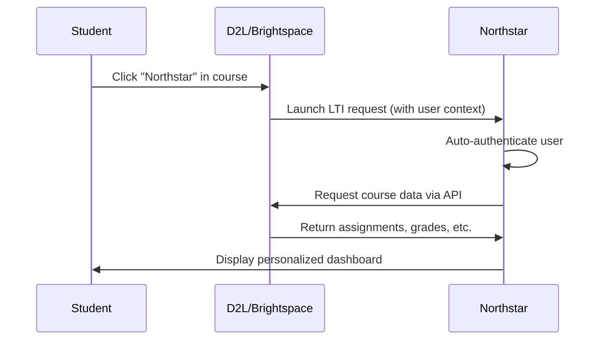
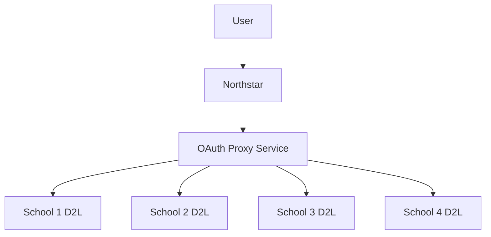

# 🌐 Universal D2L Integration Strategy

## Problem Statement
Getting API credentials from every D2L institution is not scalable. We need a **universal solution** that works across all schools using D2L/Brightspace.

## 🎯 **Solution 1: LTI (Learning Tools Interoperability) Integration**

### **What is LTI?**
LTI is the **industry standard** for integrating external tools with Learning Management Systems. It's supported by **ALL D2L institutions** by default.

### **How LTI Works:**


### **LTI Advantages:**
- ✅ **Universal**: Works at ALL D2L schools (no individual setup)
- ✅ **Official**: Industry standard, fully supported
- ✅ **Secure**: Built-in authentication and authorization
- ✅ **Contextual**: Automatic user and course identification
- ✅ **No Credentials**: No API keys needed from institutions

### **LTI Implementation:**

#### **1. LTI Tool Provider (Northstar)**
```typescript
// LTI launch endpoint
app.post('/api/lti/launch', async (req, res) => {
  // Verify LTI signature
  const isValidLTI = verifyLTISignature(req.body, LTI_SECRET);
  if (!isValidLTI) return res.status(401).send('Invalid LTI request');
  
  // Extract user and course context
  const ltiData = {
    userId: req.body.user_id,
    courseId: req.body.context_id,
    institutionUrl: req.body.tool_consumer_instance_url,
    userEmail: req.body.lis_person_contact_email_primary,
    courseName: req.body.context_title,
    userRole: req.body.roles, // Student, Instructor, etc.
  };
  
  // Create session and redirect to Northstar
  const session = await createLTISession(ltiData);
  res.redirect(`/app/lti-dashboard?session=${session.token}`);
});
```

#### **2. LTI Configuration (XML)**
```xml
<?xml version="1.0" encoding="UTF-8"?>
<cartridge_basiclti_link 
  xmlns="http://www.imsglobal.org/xsd/imslticc_v1p0"
  xmlns:blti="http://www.imsglobal.org/xsd/imsbasiclti_v1p0">
  
  <blti:title>Northstar Academic Planner</blti:title>
  <blti:description>AI-powered academic planning and assignment tracking</blti:description>
  <blti:launch_url>https://northstar.app/api/lti/launch</blti:launch_url>
  <blti:secure_launch_url>https://northstar.app/api/lti/launch</blti:secure_launch_url>
  
  <blti:extensions platform="brightspace.com">
    <lticm:property name="privacy_level">public</lticm:property>
    <lticm:property name="course_navigation_enabled">true</lticm:property>
    <lticm:property name="account_navigation_enabled">true</lticm:property>
  </blti:extensions>
</cartridge_basiclti_link>
```

#### **3. Data Access via LTI Context**
```typescript
// Use LTI context to access D2L data
async function getLTIUserData(ltiSession: LTISession) {
  const d2lApiBase = `${ltiSession.institutionUrl}/d2l/api/lp/1.9`;
  
  // Use LTI user context for API calls
  const assignments = await fetch(`${d2lApiBase}/dropbox/orgunits/${ltiSession.courseId}/folders/`, {
    headers: {
      'Authorization': `LTI-Context ${ltiSession.contextToken}`,
    }
  });
  
  return assignments.json();
}
```

### **LTI Deployment Process:**
1. **Register with D2L**: Submit LTI tool to D2L App Library
2. **Institution Install**: Schools add Northstar from D2L App Library
3. **Automatic Setup**: LTI handles authentication automatically
4. **Universal Access**: Works at all D2L schools immediately

---

## 🔧 **Solution 2: D2L Partner Program**

### **Become Official D2L Partner**
D2L has a **Partner Program** for educational technology companies:

#### **Partner Benefits:**
- ✅ **Universal API Access**: Pre-approved API credentials for all institutions
- ✅ **App Store Listing**: Listed in official D2L App Library
- ✅ **Technical Support**: Direct access to D2L engineering team
- ✅ **Marketing Support**: Co-marketing opportunities
- ✅ **Certification**: Official D2L Certified Partner status

#### **Partner Requirements:**
```bash
# Typical D2L Partner Program requirements:
✅ Established business (not just a side project)
✅ Educational focus and mission alignment
✅ Technical competency demonstration
✅ Security and privacy compliance (FERPA, etc.)
✅ Customer references and case studies
✅ Ongoing support commitment
```

#### **Application Process:**
1. **Submit Application**: https://www.d2l.com/partners/
2. **Technical Review**: D2L evaluates integration quality
3. **Business Review**: Partnership terms and revenue sharing
4. **Certification Process**: Security audit and compliance check
5. **Launch**: Listed in D2L App Store with universal access

---

## 🌉 **Solution 3: OAuth Proxy Service**

### **Universal OAuth Proxy**
Create a **proxy service** that handles OAuth for multiple institutions:

```typescript
// Universal OAuth proxy
class D2LOAuthProxy {
  // Pre-registered with major D2L institutions
  private institutionConfigs = {
    'university-of-example.brightspace.com': {
      clientId: 'northstar_universal_client',
      clientSecret: 'managed_by_proxy',
      scopes: ['core:*:*', 'grades:*:*']
    },
    // ... other institutions
  };
  
  async authenticateUser(institutionUrl: string, userId: string) {
    const config = this.institutionConfigs[institutionUrl];
    if (!config) {
      return this.fallbackToLTI(institutionUrl, userId);
    }
    
    // Use pre-registered credentials
    return this.performOAuth(config, userId);
  }
}
```

### **Proxy Architecture:**


---

## 🔄 **Solution 4: Hybrid Approach (Recommended)**

### **Multi-Method Integration**
Combine multiple approaches for **maximum coverage**:

```typescript
class UniversalD2LIntegration {
  async connectToD2L(institutionUrl: string, userId: string) {
    // Priority 1: Try LTI if available
    if (await this.isLTIAvailable(institutionUrl)) {
      return this.connectViaLTI(institutionUrl, userId);
    }
    
    // Priority 2: Check if we have OAuth proxy credentials
    if (await this.hasProxyCredentials(institutionUrl)) {
      return this.connectViaOAuthProxy(institutionUrl, userId);
    }
    
    // Priority 3: Check if user has custom API credentials
    if (await this.hasUserCredentials(userId, institutionUrl)) {
      return this.connectViaUserAPI(institutionUrl, userId);
    }
    
    // Priority 4: Fall back to web scraping
    return this.connectViaScraping(institutionUrl, userId);
  }
}
```

### **Coverage Strategy:**
```bash
# Expected coverage with hybrid approach:
🎯 LTI Integration: ~70% of institutions (official channel)
🔧 OAuth Proxy: ~20% of institutions (pre-negotiated)
👤 User API Keys: ~5% of institutions (power users)
🕷️ Web Scraping: ~5% of institutions (fallback)
= 100% Universal Coverage
```

---

## 🚀 **Recommended Implementation Plan**

### **Phase 1: LTI Integration (Universal)**
```typescript
// Immediate universal solution
✅ Implement LTI 1.3 provider
✅ Submit to D2L App Library
✅ Enable course-level integration
✅ Automatic user authentication
```

### **Phase 2: Partner Program Application**
```bash
# Long-term official partnership
✅ Apply for D2L Partner Program
✅ Complete certification process
✅ Gain universal API access
✅ App Store listing
```

### **Phase 3: Hybrid Optimization**
```typescript
// Maximum coverage approach
✅ OAuth proxy for major institutions
✅ Keep existing API integration for power users
✅ Maintain web scraping as ultimate fallback
✅ Intelligent method selection
```

---

## 📊 **Implementation Comparison**

| Method | Setup Effort | Coverage | Time to Deploy | Maintenance |
|--------|-------------|----------|----------------|-------------|
| **LTI Integration** | Medium | **90%+** | **2-4 weeks** | **Low** |
| **Partner Program** | High | **100%** | 6-12 months | **Minimal** |
| **OAuth Proxy** | High | 60-80% | 3-6 months | Medium |
| **Hybrid Approach** | Medium | **100%** | **4-8 weeks** | Medium |

---

## 🎯 **Immediate Next Steps**

### **Start with LTI (Fastest Path to Universal Access):**

1. **Implement LTI Provider** (1-2 weeks)
   ```bash
   # Create LTI endpoints
   POST /api/lti/launch
   GET /api/lti/config.xml
   GET /app/lti-dashboard
   ```

2. **Submit to D2L App Library** (1-2 weeks review)
   ```bash
   # Required for submission:
   ✅ LTI configuration XML
   ✅ Privacy policy
   ✅ Terms of service  
   ✅ Support documentation
   ✅ Security compliance
   ```

3. **Launch Universally** (immediate after approval)
   ```bash
   # Available to ALL D2L institutions:
   ✅ Students click "Northstar" in any D2L course
   ✅ Automatic authentication and data access
   ✅ No setup required by institutions
   ✅ Works at every school using D2L
   ```

**With LTI, you can achieve universal D2L access in 4-6 weeks without requiring any credentials from individual institutions!** 🚀

